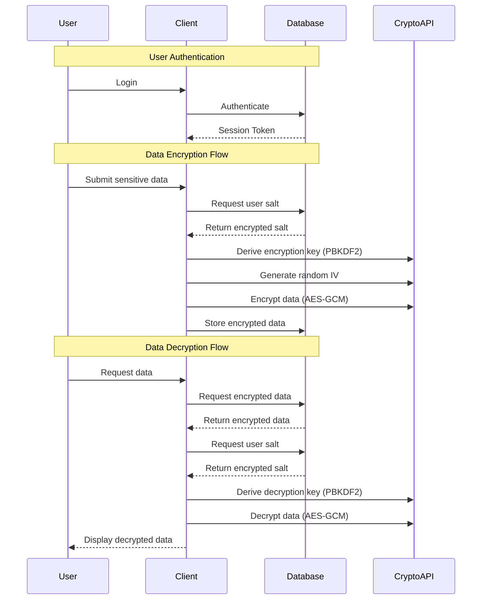

# Security Overview

## Encryption System

Our application implements a robust encryption system to protect sensitive user data. Here's how it works:

### Key Security Features

1. **User-Specific Salts**
   - Each user has a unique 32-byte salt stored in the database
   - Salts are generated using cryptographically secure random bytes
   - Salts are protected by Row Level Security (RLS) policies

2. **Key Derivation**
   - Uses PBKDF2 (Password-Based Key Derivation Function 2) with:
     - 1000 iterations
     - SHA-256 hash function
     - User-specific salt
   - This makes brute force and rainbow table attacks computationally expensive

3. **Encryption Algorithm**
   - Uses AES-GCM (Advanced Encryption Standard in Galois/Counter Mode)
   - 256-bit key length
   - Provides both confidentiality and authenticity
   - Includes a random IV (Initialization Vector) for each encryption operation

4. **Data Protection**
   - Sensitive fields are encrypted before storage
   - Each encrypted data block includes:
     - Version number for future compatibility
     - Timestamp for audit purposes
     - Random IV for each encryption operation

## Data Flow Diagram

## Security Benefits

1. **Resistance to Rainbow Table Attacks**
   - Each user's unique salt means attackers would need to create separate rainbow tables for each user
   - The computational cost of creating these tables makes the attack impractical

2. **Protection Against Brute Force**
   - PBKDF2's 1000 iterations significantly increase the computational cost of brute force attacks
   - The 256-bit key length provides a massive keyspace (2^256 possible keys)

3. **Data Integrity**
   - AES-GCM provides authenticated encryption
   - Any tampering with the encrypted data will be detected during decryption

4. **Forward Secrecy**
   - Each encryption operation uses a unique IV
   - Even if one key is compromised, other encrypted data remains secure

5. **Access Control**
   - Row Level Security ensures users can only access their own data
   - Salts are protected by RLS policies
   - Authentication is required for all data operations

## Best Practices

1. **Key Management**
   - Keys are never stored, only derived when needed
   - Keys are scoped to specific operations (encrypt/decrypt)
   - Keys are cleared from memory after use

2. **Error Handling**
   - Failed decryption attempts return null instead of partial data
   - All errors are logged for security auditing
   - No sensitive information is exposed in error messages

3. **Data Validation**
   - All encrypted data includes version and timestamp
   - Invalid or tampered data is rejected during decryption
   - Data structure is validated before processing

## Future Considerations

1. **Key Derivation Improvements**
   - Increase PBKDF2 iterations to at least 10,000 (current NIST recommendation)
   - Consider using Argon2 or scrypt for better resistance against hardware-accelerated attacks

2. **Key Rotation**
   - Implement periodic key rotation for enhanced security
   - Add support for multiple key versions

3. **Enhanced Protection**
   - Implement rate limiting for decryption attempts
   - Add support for hardware security modules (HSMs)

4. **Audit Trail**
   - Implement comprehensive logging of encryption/decryption operations
   - Add support for security event monitoring